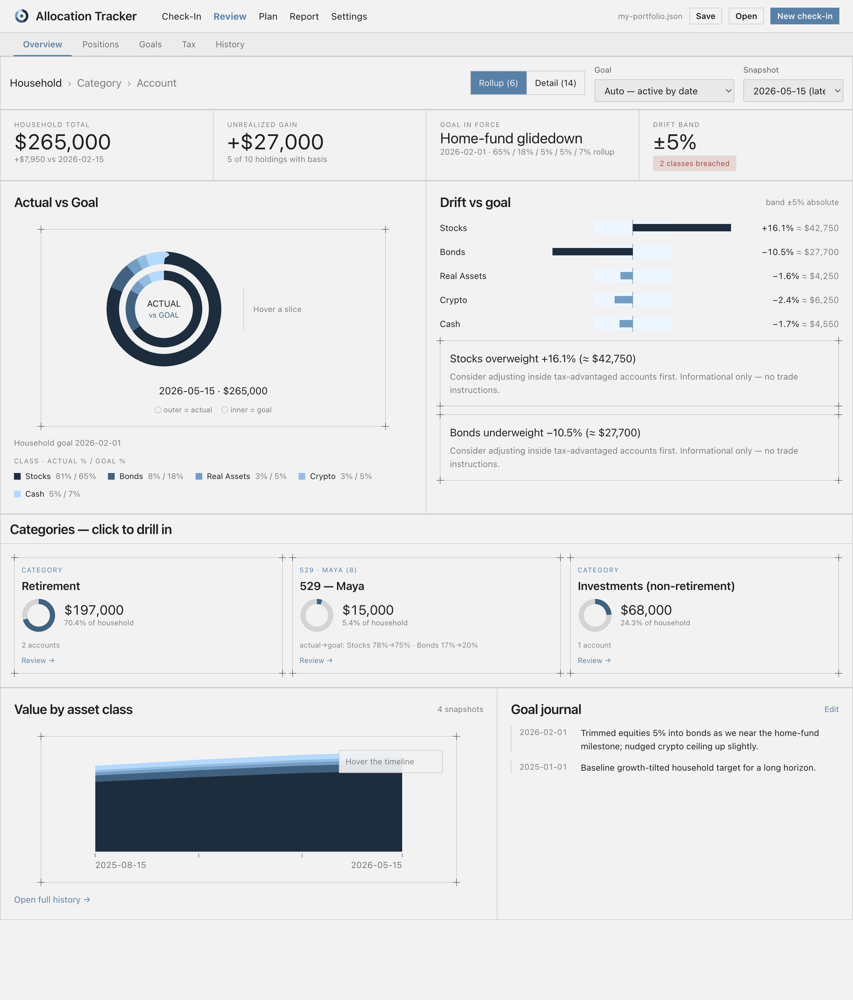

# Allocation Tracker

A single-file, fully-offline web app for tracking your true asset allocation
across every account — then planning tax-aware moves to stay on target.

It's one `allocation-tracker.html` file. Open it in a browser and it runs; your
numbers live in a JSON file you save yourself. No server, no accounts, no
network, no tracking. You can email the same file to a friend and they can use
it too.



*Review › Overview: household allocation vs. goal, drift bars, category drill-down, and history — shown with demo data.*

---

## Highlights

- **See what you actually own.** Combine every account — taxable, 401k/IRA,
  Roth, HSA, 529 — into one allocation picture, by asset class and by rollup
  (stocks / bonds / real assets / crypto / cash / blend).
- **Quarterly check-ins.** "New check-in" pre-fills last time's values; you just
  overtype what changed. A running total sanity-checks against your net worth.
- **Goals & drift.** Set a target allocation (with a required rationale note,
  journaled over time) and see drift vs the ±band, per class.
- **529 glide paths.** Each child gets an age-based glide target; 529s are
  measured against it instead of the household goal.
- **Tax analysis.** A tax-posture scorecard: per-holding annual tax drag,
  a Location Efficiency score, the tax you're *shielding* by good placement,
  and allocation-neutral **location-swap** and **muni** recommendations.
- **Quarterly Plan.** Auto-generated from your drift *and* tax posture, then
  fully editable: moves, an explicit no-action decision, and a savings
  directive for new contributions — with a live before/after simulator and
  wash-sale warnings.
- **Report.** A clean, print-to-PDF allocation report (household, retirement,
  per-child 529, non-retirement), including the committed plan and tax
  scorecard. CSV export too.

Everything is computed locally. Tax figures are estimates from simplified rules
and your inputs — **not tax advice**.

---

## Getting started

1. **Open the app.** Double-click `allocation-tracker.html`, or open it from the
   browser. (Chrome/Edge get one-click save-back via the File System Access API;
   Safari/Firefox fall back to download/upload.)
2. **Add accounts & holdings**, or click **Load demo data** to explore.
3. **Do a check-in** to record current values.
4. **Set a goal** in Review › Goals.
5. **Review** your allocation, tax posture, and history.
6. **Plan** the quarter, then **Save** your file.

Your data is saved to `my-portfolio.json`. Keep it in an iCloud/Dropbox folder
for automatic version history. **The app never uploads or stores your data in
the browser — the file is the only copy, so remember to Save.**

### The five tabs

- **Check-In** — record current values (pre-filled from last time). First run
  shows the onboarding here.
- **Review** — *Overview* (allocation vs. goal + drift), *Positions* (holdings
  drill-down), *Goals* (targets, 529 glide paths, rationale journal), *Tax*
  (drag scorecard + recommendations), *History*.
- **Plan** — a quarterly plan auto-generated from your drift and tax posture;
  edit the moves, simulate before/after, or record an explicit no-action.
- **Report** — a print-to-PDF summary as of a snapshot, including the committed
  plan and tax scorecard. Also exports CSV.
- **Settings** — *Accounts*, *Household* (children + 529 glide assignments),
  *Tax Profile* (bracket picker, gain budget, monthly savings), *Data & Privacy*
  (save/load/export/start-fresh).

Click the logo any time for the About/Help panel.

---

## Privacy & offline

- **Zero network requests.** No CDN, no fonts, no telemetry, no fund-data
  refresh. Verify it yourself: open dev tools → Network, or turn off Wi-Fi.
- Nothing is written to browser storage except a *reference* to your chosen
  file (so it can re-open it) — never the data itself.

---

## Tech

Vanilla JavaScript, inline CSS, hand-rolled SVG charts. No framework, no build
step, no dependencies — the HTML file *is* the source. Styled in Enigma's
"Industry" blueprint design system.

Tax reference data (brackets, thresholds, state rates, contribution limits) is
embedded and labelled with its tax year; it's fully editable in
Settings › Tax Profile.

---

## Development

Golden rules: **one file** (all CSS/JS inline), **zero network requests**,
**never touch a real user's data file** (test only on throwaway copies),
**additive schema migrations only** (never drop data), and **`$`+comma currency
formatting** everywhere. A local `CLAUDE.md` (untracked) holds the full agent
guide with architecture and conventions.

Quick checks:

```bash
# syntax
python3 - <<'PY'
import re; h=open('allocation-tracker.html').read()
m=re.search(r'\n<script>\n(.*)\n</script>',h,re.S); open('/tmp/_c.js','w').write(m.group(1))
PY
node --check /tmp/_c.js

# serve a copy to test in a browser (never test against your real data file)
mkdir -p /private/tmp/aat && cp allocation-tracker.html /private/tmp/aat/index.html
cd /private/tmp/aat && python3 -m http.server 8747   # → http://localhost:8747
```

---

## Disclaimer

This tool is for personal tracking and education. Tax and allocation figures are
estimates from simplified rules and the data you enter. It never executes any
trade. Confirm material financial decisions with a qualified professional.
